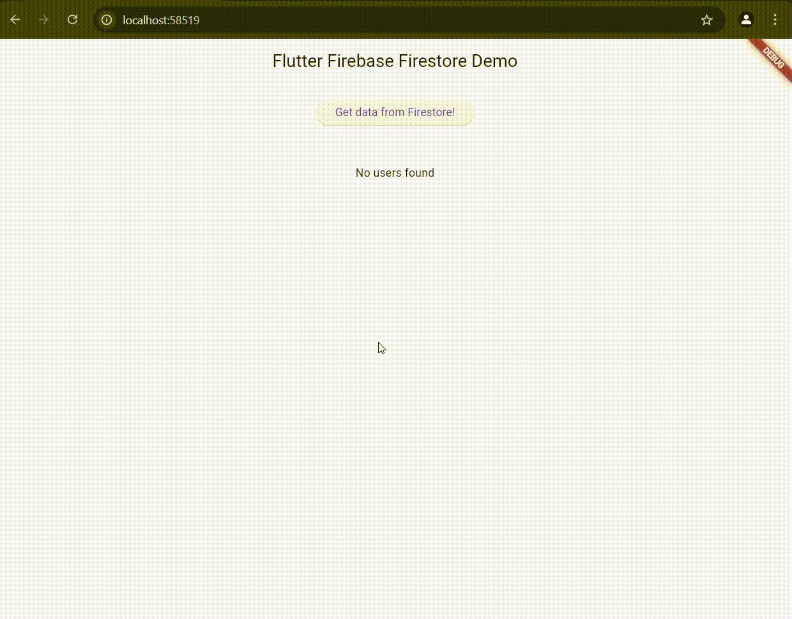

# Flutter Firebase Firestore

A simple implementation of a Flutter app with Firebase Firestore as the database. This app demonstrates how to retrieve data from Firestore with minimal code. If you want to perform additional database operations, you can update the code in the [`repository`](lib/repository/). Be sure that your Firestore rules are set up to allow those operations. For more information on Firestore rules, check out the official guide: https://firebase.google.com/docs/firestore/security/get-started

## Dependencies
- `firebase_core`: for initializing Firebase
- `cloud_firestore`: for accessing Firestore

## Demonstration

